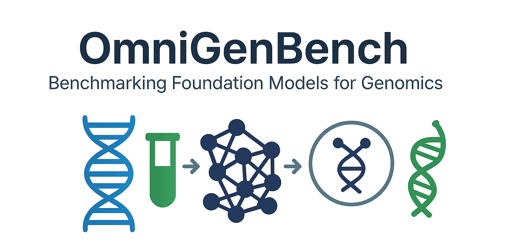

<h3 align="center">OmniGenBench is a modular benchmarking platform for evaluating genomic foundation models (GFMs) across diverse tasks like RNA structure prediction, gene function classification, and multi-species generalization.</h3>

<div align="center">

  <a href="https://pypi.org/project/omnigenome/">
    
  </a>

  <a href="https://pepy.tech/project/omnigenome">
    
  </a>

  <a href="https://pypi.org/project/omnigenbench/">
    
  </a>

  <a href="https://github.com/yangheng95/omnigenome/blob/main/LICENSE">
    
  </a>

</div>
<h3 align="center">
  <a href="#installation">📦 Installation</a>
  <span> · </span>
  <a href="#quick-start">🚀 Getting Started</a>
  <span> · </span>
  <a href="#supported-models">🧬 Model Support</a>
  <span> · </span>
  <a href="#benchmarks">📊 Benchmarks </a>
  <span> · </span>
  <a href="#tutorials">🧪 Application Tutorials</a>
  <span> · </span>
  <a href="https://arxiv.org/pdf/2505.14402">📚 Paper</a>
</h3>


## 🔍 What You Can Do with OmniGenBench?

- 🧬 **Benchmark effortlessly** — Run automated and reproducible evaluations for genomic foundation models  
- 🧠 **Understand your models** — Explore interpretability across diverse tasks and species  
- ⚙️ **Run tutorials instantly** — Use click-to-run guides for genomic sequence modeling  
- 🚀 **Train and infer efficiently** — Accelerated workflows for training and inference on GFMs  

## Installation

### Requirements
Before installing OmniGenome, you need to install the following dependencies:
- Python 3.10+
- PyTorch 2.5+
- Transformers 4.46.0+

### PyPI Installation
To install OmniGenome, you can use pip:
```bash
pip install omnigenome -U
```

### Source Installation
Or you can clone the repository and install it from source:
```bash
git clone [https://github.com/yangheng95/OmniGenBench.git](https://github.com/yangheng95/OmniGenBench.git)
cd OmniGenBench
pip install -e .
```

## Quick Start
`OmniGenBench is available for diverse models and benchmark suites, please refer to the  following sections for more details.`
### Auto-benchmark via CLI
The following command will download the model from the Hugging Face model hub and run the benchmark on the RGB benchmark:
```bash
autobench --model_name_or_path "yangheng/OmniGenome-186M" --benchmark "RGB" --trainer accelerate
```
You can find a visualization of AutoBench [here](asset/AutoBench.gif).


### Auto-benchmark via Python API
Or you can use the following python code to run the auto-benchmark:
```python
from omnigenome import AutoBench
gfm = 'LongSafari/hyenadna-medium-160k-seqlen-hf'
# benchmark could be "RGB", "GB", "PGB", "GUE", which will be downloaded from the Hugging Face model hub
benchmark = "RGB"
bench_size = 8
seeds = [0, 1, 2, 3, 4]
bench = AutoBench(benchmark=benchmark, model_name_or_path=gfm, overwrite=False)
bench.run(autocast=False, batch_size=bench_size, seeds=seeds)
```
You can find an example of AutoBench via Python API [here](examples/tutorials/AutoBench_Tutorial.ipynb).

## Supported Models


OmniGenBench provides plug-and-play evaluation for over **30 genomic foundation models**, covering both **RNA** and **DNA** modalities. The following are highlights:

| Model          | Params | Pre-training Corpus                        | Highlights                                          |
|----------------|--------|--------------------------------------------|-----------------------------------------------------|
| **OmniGenome** | 186M   | 54B plant RNA+DNA tokens                   | Multi-modal, structure-aware encoder                |
| **Agro-NT-1B** | 985M   | 48 edible-plant genomes                    | Billion-scale DNA LM w/ NT-V2 k-mer vocab           |
| **RiNALMo**    | 651M   | 36M ncRNA sequences                        | Largest public RNA LM; FlashAttention-2             |
| **DNABERT-2**  | 117M   | 32B DNA tokens, 136 species (BPE)          | Byte-pair encoding; 2nd-gen DNA BERT                |
| **RNA-FM**     | 96M    | 23M ncRNA sequences                        | High performance on RNA structure tasks             |
| **RNA-MSM**    | 96M    | Multi-sequence alignments                  | MSA-based evolutionary RNA LM                       |
| **NT-V2**      | 96M    | 300B DNA tokens (850 species)              | Hybrid k-mer vocabulary                             |
| **HyenaDNA**   | 47M    | Human chromosomes                          | Long-context autoregressive model (1Mb)             |
| **SpliceBERT** | 19M    | 2M pre-mRNA sequences                      | Fine-grained splice-site recognition                |
| **Caduceus**   | 1.9M   | Human chromosomes                          | Ultra-compact DNA LM (RC-equivariant)               |
| **RNA-BERT**   | 0.5M   | 4,000+ ncRNA families                      | Small BERT with nucleotide masking                  |
| *...and more*  | —      | See Appendix E of the paper                | Includes PlantRNA-FM, UTR-LM, MP-RNA, CALM, etc.    |

## Benchmarks

OmniGenBench supports five curated benchmark suites covering both **sequence-level** and **structure-level** genomics tasks across species.

| Suite        | Focus                       | #Tasks / Datasets        | Sample Tasks                                         |
|--------------|-----------------------------|--------------------------|------------------------------------------------------|
| **RGB**      | RNA structure + function    | 12 tasks (SN-level)      | RNA secondary structure, SNMR, degradation prediction |
| **BEACON**   | RNA (multi-domain)          | 13 tasks                 | Base pairing, mRNA design, RNA contact maps         |
| **PGB**      | Plant long-range DNA        | 7 categories             | PolyA, enhancer, chromatin access, splice site      |
| **GUE**      | DNA general tasks           | 36 datasets (9 tasks)    | TF binding, core promoter, enhancer detection       |
| **GB**       | Classic DNA classification  | 9 datasets               | Human/mouse enhancer, promoter variant classification|


## Tutorials

### RNA Design
RNA design is a fundamental problem in synthetic biology,
where the goal is to design RNA sequences that fold into a target structure.
In this demo, we show how to use OmniGenome to design RNA sequences 
that fold into a target structure using a pre-trained model.
The tutorials of RNA Design Demo can be found in [RNA_Design_Tutorial.ipynb](examples/tutorials/RNA_Design_Tutorial.ipynb).

You can find a visual example of RNA Design [here](asset/RNA_Design.gif).

### RNA Secondary Structure Prediction

RNA secondary structure prediction is a fundamental problem in computational biology,
where the goal is to predict the secondary structure of an RNA sequence.
In this demo, we show how to use OmniGenome to predict the secondary structure of RNA sequences using a pre-trained model.
The tutorials of RNA Secondary Structure Prediction can be found in
[Secondary_Structure_Prediction_Tutorial.ipynb](examples/tutorials/Secondary_Structure_Prediction_Tutorial.ipynb).

You can find a visual example of RNA Secondary Structure Prediction [here](asset/RNA_Structure_Prediction.gif).

### More Tutorials
Please find more usage tutorials in [examples/tutorials](examples/tutorials).

## Citation
```bibtex
@article{yang2024omnigenbench,
      title={OmniGenBench: A Modular Platform for Reproducible Genomic Foundation Models Benchmarking}, 
      author={Heng Yang and Jack Cole, Yuan Li, Renzhi Chen, Geyong Min and Ke Li},
      year={2024},
      eprint={https://arxiv.org/abs/2505.14402},
      archivePrefix={arXiv},
      primaryClass={q-bio.GN},
      url={https://arxiv.org/abs/2505.14402}, 
}
```
## License
OmniGenomeBench is licensed under the Apache License 2.0. See the LICENSE file for more information.


## Contribution
We welcome contributions to OmniGenomeBench! If you have any ideas, suggestions, or bug reports, please open an issue or submit a pull request on GitHub.
