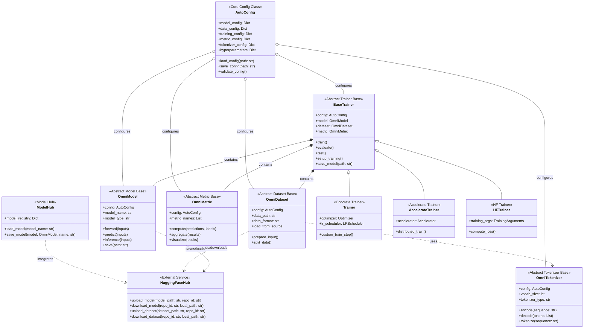
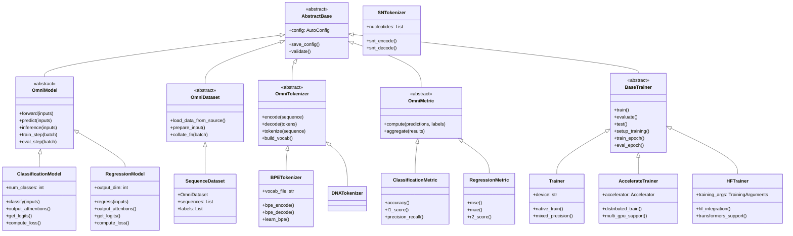
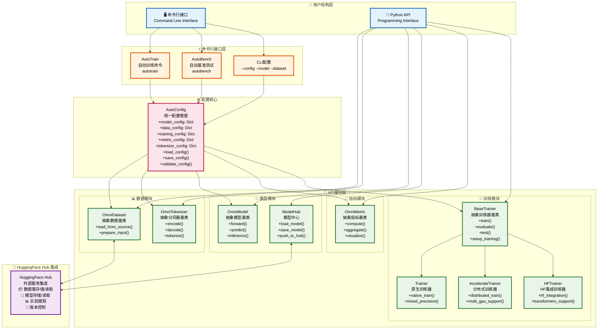
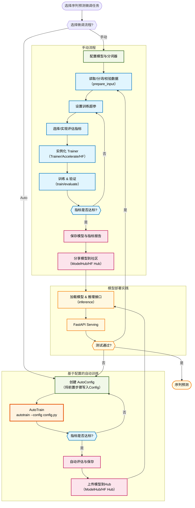

# OmniGenBench 框架架构


## 1. 面向Config的架构详细图



## 2. 面向API模块抽象层次结构




## 3. 面向Interface框架架构



## 4. 微调流程图




## 框架设计原则实现

### 1. ✅ 用户结构层分离
- **命令行接口**: AutoTrain、AutoBench等CLI命令
- **Python API**: 数据集、模型、分词器、指标库、训练器等模块

### 2. ✅ 抽象基类集成
- **OmniDataset**: 数据集抽象基类
- **OmniModel**: 模型抽象基类  
- **OmniTokenizer**: 分词器抽象基类
- **OmniMetric**: 指标库抽象基类
- **BaseTrainer**: 训练器抽象基类

### 3. ✅ 主要类方法和属性
每个模块都详细列出了核心方法和属性，包括：
- 数据处理方法 (`__getitem__`, `preprocess`)
- 模型推理方法 (`forward`, `predict`, `inference`)
- 配置加载方法 (`load_from_config`)

### 4. ✅ 配置驱动框架
- **AutoConfig**: 统一配置管理所有模块信息和超参数
- **配置注入**: 所有模块都通过config进行初始化和配置

### 5. ✅ 完整微调流程
详细的9步微调流程：
```
加载Config → 设置模型分词器 → 读取数据分词 → 设置Metric → 
实例化训练器 → AutoTrain引擎 → 保存ModelHub → 读取模型 → 部署
```

### 6. ✅ HuggingFace Hub集成
- 支持模型和数据集的上传下载
- 版本控制和实验���踪
- 与社区生态深度集成
